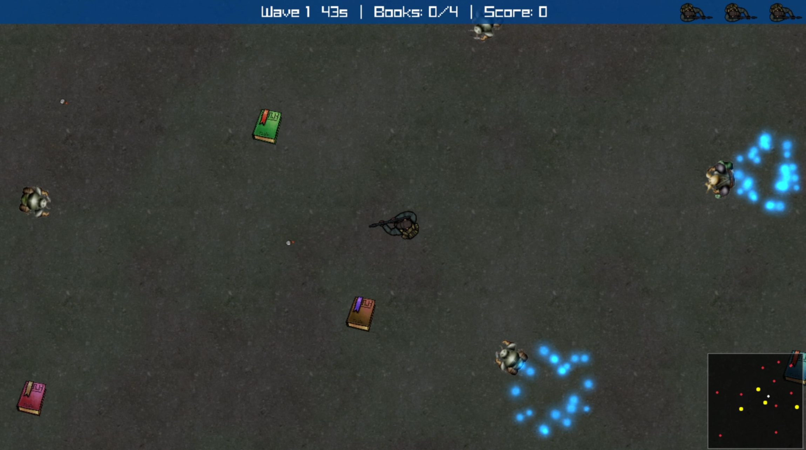

# Zombie Swarm - Raylib C++ Tutorial Series

A top-down zombie survival shooter built from scratch with [raylib](https://www.raylib.com/) and C++. This repository is the companion starter for the **YouTube tutorial series** by [BlueFever Software](https://www.youtube.com/@BlueFeverSoft).



## About the Game

Survive waves of increasingly difficult enemies while collecting books and power-ups across a tile-based map.

**Features:**
- Top-down shooter with shotgun combat
- Wave-based enemy spawning with multiple enemy types (cockroaches, klivers, scorpions, trolls)
- Particle effects for muzzle flash and hit impacts
- Collision masks
- Pickups: health potions, books, and more
- HUD displaying wave number, timer, book collection progress, and score
- Minimap
- Sound effects and background music

## What You'll Learn

- Component-based entity design with manager pattern
- Object pooling for bullets, enemies, pickups, and particles
- Sprite sheet animation
- Image-based collision masks 
- Particle systems
- Wave-based spawning with enemy AI (homing and retarget behaviors)
- Sound banks with random variant selection and pitch variation
- Camera following with map-boundary clamping
- Input abstraction with relative mouse aiming
- RenderTexture canvas with letterboxing
- Resource caching and smart pointer ownership

## Repository Structure

```
├── SetupFiles/          Platform setup guides (Windows, Linux, macOS)
│   ├── windows/
│   ├── linux/
│   └── mac/
├── assets/
│   ├── audio/           Sound effects (.wav) and music (.mp3)
│   └── images/          Sprites, backgrounds (.png)
├── shots/               Screenshots
├── LICENSE              MIT
└── README.md
```

## Getting Started

### Prerequisites

- A C/C++ compiler
- [raylib](https://www.raylib.com/) installed for your platform
- [VS Code](https://code.visualstudio.com/) (recommended)

### Platform Setup

Follow the guide for your OS in the `SetupFiles/` directory:

| Platform | Guide |
|----------|-------|
| Windows  | [SetupFiles/windows/setup.md](SetupFiles/windows/setup.md) |
| Linux    | [SetupFiles/linux/setup.md](SetupFiles/linux/setup.md) |
| macOS    | [SetupFiles/mac/install.md](SetupFiles/mac/install.md) |

### Assets

Copy the `assets/` folder into your project's build directory so the game can find the images and audio at runtime.

## Tutorial Series

Each part of the series has its own branch. Switch to the branch matching the video you're following:

| Part | Branch | Topic |
|------|--------|-------|
| 1    | `part-1` | *Setup* |
| 2    | `part-2` | *Camera* |
| ...  | ...    | ... |

New branches will be added as videos are released.

## License

This project is licensed under the MIT License - see the [LICENSE](LICENSE) file for details.

## Links

- YouTube: [BlueFever Software](https://www.youtube.com/@BlueFeverSoft)
- raylib: [https://www.raylib.com](https://www.raylib.com/)
